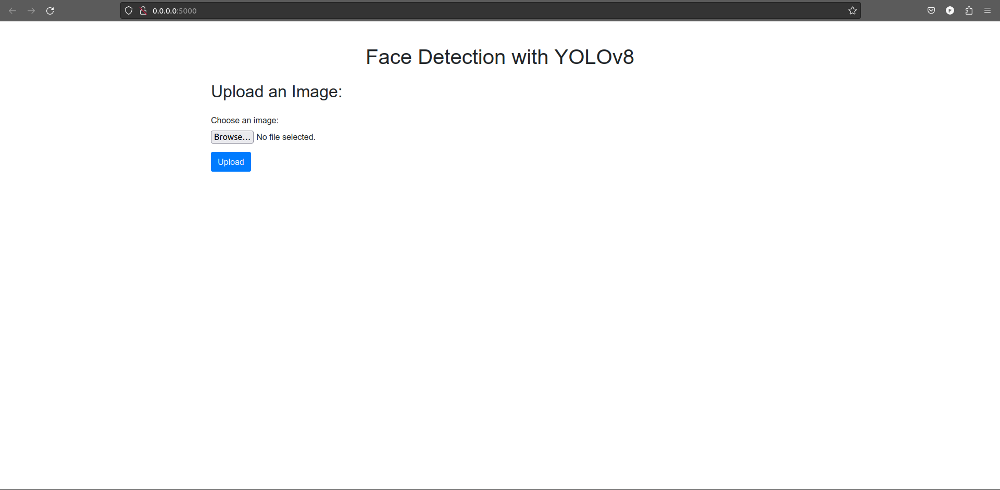
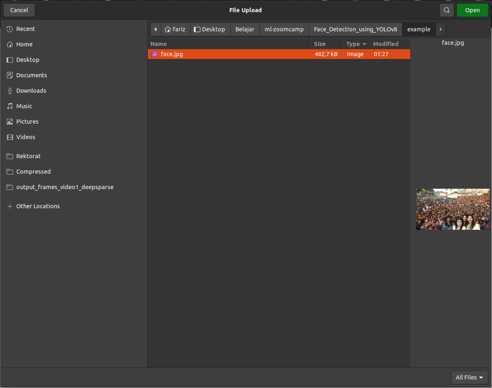
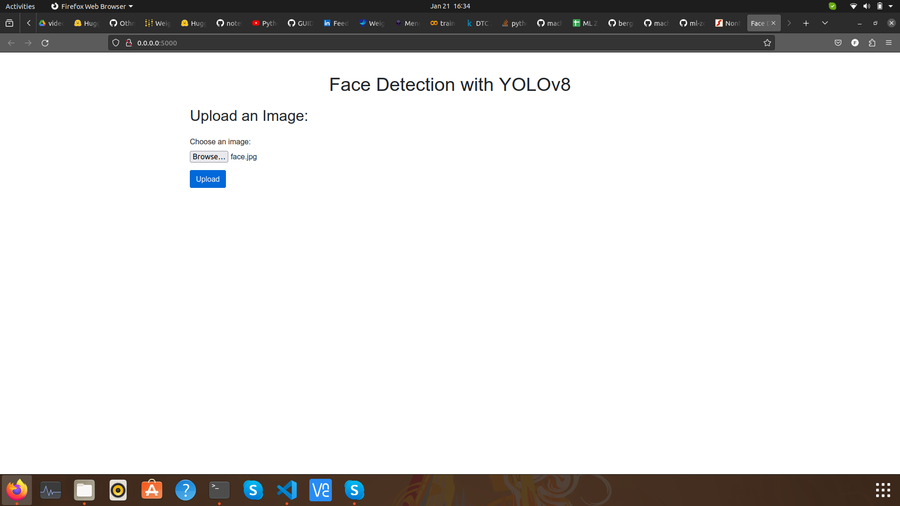
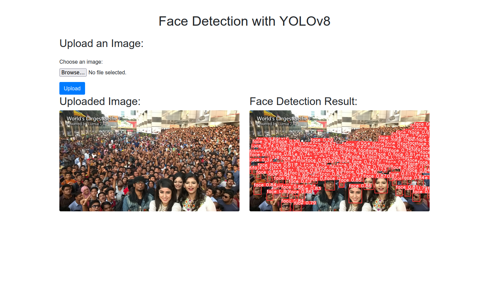

# Face Detection using YOLOv8

## Introduction

Face detection is a computer vision technology that helps to locate human faces in digital images. This technology is a crucial part of many applications, including security systems, photography, and social media platforms.

In this project, we utilize YOLOv8, a state-of-the-art object detection system, for face detection. YOLOv8, or You Only Look Once version 8, is renowned for its ability to detect objects in real-time. It's incredibly fast and accurate, making it ideal for applications that require real-time detection.

We've trained our YOLOv8 model to focus on detecting faces. This allows the model to identify and locate faces in images with high precision. Whether you're looking to count the number of people in a crowd, identify individuals in a security feed, or automatically tag people in social media photos, our face detection system can get the job done efficiently and accurately.

## Dataset
Use costume dataset from roboflow universe. The dataset can be downloaded from this repository [here](https://github.com/farizalmustaqim/ml-zoomcamp/blob/main/Face_Detection_using_YOLOv8/dataset/custom_dataset.zip).

## Training
The training process is done using Google Colab. The training process is done using the following steps:
### 1. Clone the repository

```bash

git clone https://github.com/farizalmustaqim/ml-zoomcamp.git

```
### 2. Go to the directory

```bash
cd ml-zoomcamp/face-detection-using-yolov8/train


```
### 3. Upload the train.ipynb to Google Colab


## Test the model

### 2. Install the requirements

```bash
pip install pipenv 
pipenv install  
    
```

### 3. Run the project


```bash
pipenv run gunicorn --bind 0.0.0.0:5000 main:app

```

### 4. Test the project

access the following url in your browser such as Google Chrome, Mozilla Firefox, etc.
visit http://localhost:5000 or http://0.0.0.0:5000

Like this:



Upload an image that you want to detect the face.



After that, click the "Upload" button.



The result will be like this:



## Conterization

### 1. Build the image

```bash
docker build -t farizalmustaqim/face-detection-using-yolov8:latest .

```

### 2. Run the image

```bash
docker run -it --rm -p 5000:5000 farizalmustaqim/face-detection-using-yolov8:latest

```